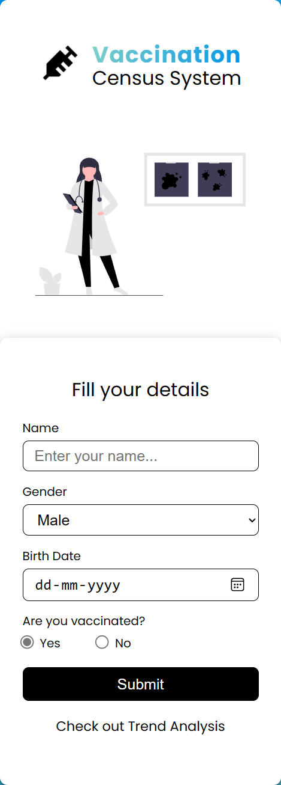

# Vaccination Census System and Trend Analysis

The Vaccination Census System is a web-based application for collecting and analyzing census data, specifically focusing on vaccination and trend analysis.

### Stack
MySQL<br>
Express<br>
React<br>
Node<br>
<br>





## Table of Contents

- [Features](#features)
- [Getting Started](#getting-started)
  - [Prerequisites](#prerequisites)
  - [Installation](#installation)
- [Usage](#usage)

## Features

- Record and store individual census data, including name, gender, birthdate, and vaccination status.
- Analyze census data to determine vaccination trends and demographic distribution.
- Visualize census data with charts to gain insights into vaccination and demographics.
- A user-friendly interface for data entry and analysis.

## Getting Started

These instructions will help you set up and run the project on your local machine.

### Prerequisites

Make sure you have the following software installed:

- Node.js (version 14 or higher)
- npm (Node Package Manager)

### Installation

clone the repo 
```
git clone https://github.com/thisisrohitkumar/taghash_vaccination_census_system.git
```

```
cd taghash_vaccination_census_system
```
#### Install Nodejs dependencie
```
cd server
```
```
npm install
```
download nodemon globally
```
npm start
```
### Install Reactjs dependencies

```
cd .. 
```
```
cd client
```
```
npm install
```
```
npm start
```

### usage

visit: https//localhost:3000/ to get the home page
and https//localhost:3000/trend to get the trend analysis